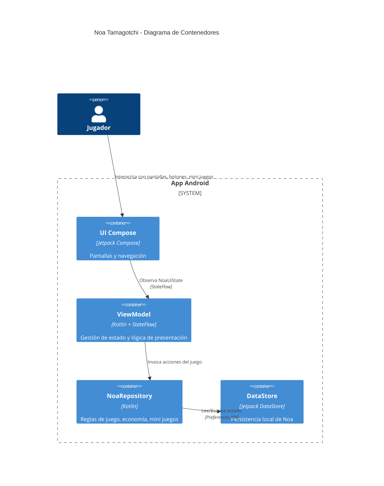

```mermaid
C4Container
    title Noa Tamagotchi - Diagrama de Contenedores
    Person(user, "Jugador")
    System_Boundary(app, "App Android") {
        Container(ui, "UI Compose", "Jetpack Compose", "Pantallas y navegación")
        Container(viewModel, "ViewModel", "Kotlin + StateFlow", "Gestión de estado y lógica de presentación")
        Container(repository, "NoaRepository", "Kotlin", "Reglas de juego, economía, mini juegos")
        Container(datastore, "DataStore", "Jetpack DataStore", "Persistencia local de Noa")
    }

    Rel(user, ui, "Interactúa con pantallas, botones, mini juegos")
    Rel(ui, viewModel, "Observa NoaUiState", "StateFlow")
    Rel(viewModel, repository, "Invoca acciones del juego")
    Rel(repository, datastore, "Lee/Escribe estado", "Preferences API")
```
