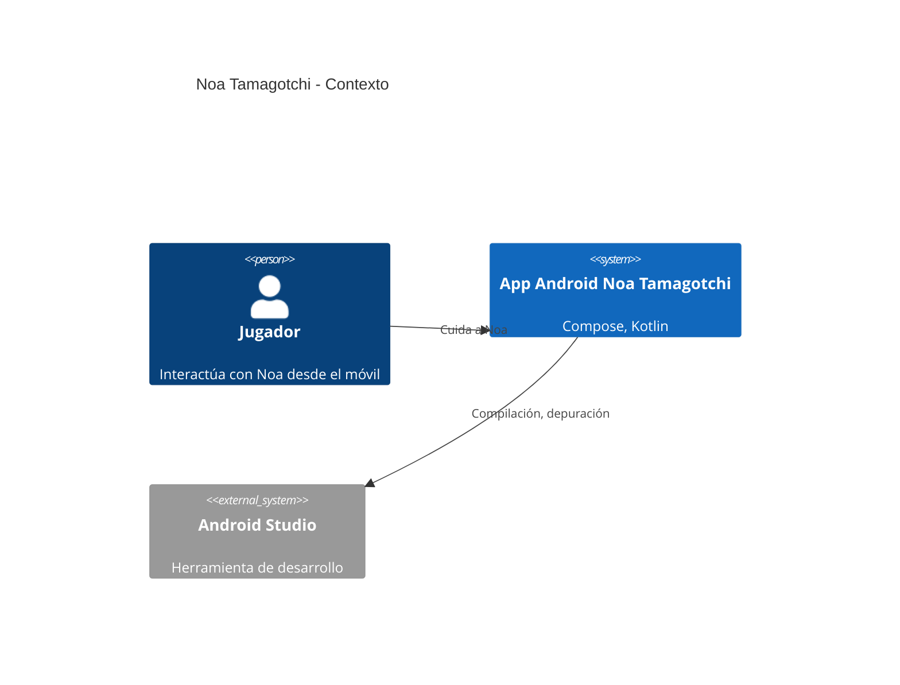
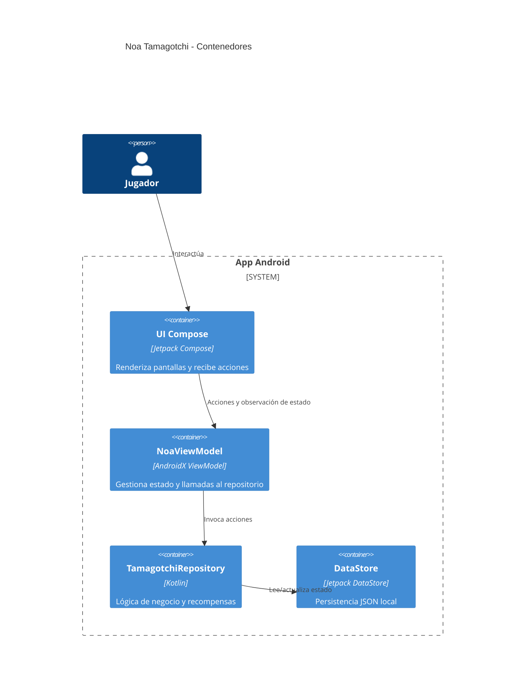

# Tech Spec - Noa Tamagotchi

## Contexto
La aplicación ofrece un tamagotchi digital centrado en acciones básicas (alimentar, jugar, descansar y asear). El objetivo del refactor fue restaurar un build reproducible y fácil de mantener, eliminando dependencias experimentales y pantallas innecesarias.

## Arquitectura
- **DataStore (Persistencia):** `TamagotchiPreferencesDataSource` serializa el estado con Kotlin Serialization en un archivo JSON local.
- **Repositorio:** `TamagotchiRepository` aplica reglas de negocio (degradación de atributos, recompensas diarias, nivelación) y controla la fuente de tiempo.
- **ViewModel:** `NoaViewModel` expone `StateFlow<NoaUiState>` para Compose y reacciona a acciones del usuario.
- **UI Compose:** `HomeScreen` muestra métricas y botones accesibles, con `Snackbar` para mensajes.

### Diagrama C4 - Nivel C1 (Contexto)

### Diagrama C4 - Nivel C2 (Contenedores)

## Tecnologías
- Kotlin 1.9.24
- Jetpack Compose Material 3 (BOM 2024.06.00)
- AndroidX ViewModel + StateFlow
- Jetpack DataStore + Kotlin Serialization
- Kotlin Coroutines + `kotlinx-coroutines-test`

## Contratos principales
- `TamagotchiRepository.state: Flow<TamagotchiState>`
- `TamagotchiRepository.refresh(): TamagotchiState`
- `TamagotchiRepository.applyAction(TamagotchiAction): TamagotchiState`
- `TamagotchiRepository.rewardDailyCoins(): TamagotchiState`
- `NoaViewModel.uiState: StateFlow<NoaUiState>`

## Seguridad
- No se almacenan secretos ni datos personales.
- UI accesible con etiquetas descriptivas.
- Arquitectura por capas permite introducir autenticación/RBAC en el futuro.
- Dependencias obtenidas solo de repositorios oficiales (Google, Maven Central).

## Plan de pruebas
- Pruebas unitarias en `TamagotchiRepositoryTest` cubren acciones, recompensas y degradación temporal.
- Validación manual: ejecutar la app en emulador, revisar métricas y mensajes.
- Pipeline sugerida: `lint → typecheck → test → build → sbom → scan → docker build → deploy`.
